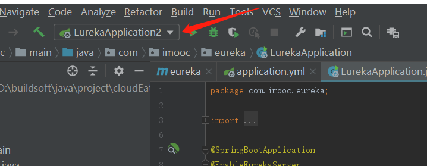
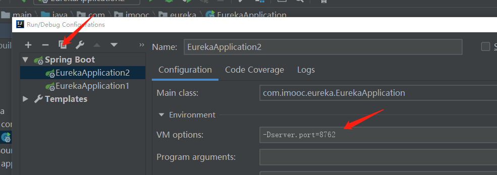
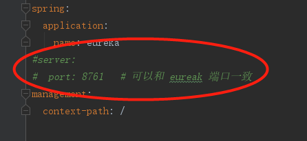
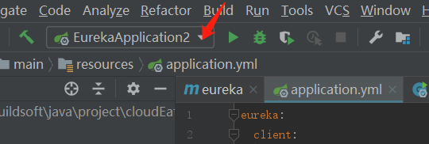

# spring-cloud-2020
spring cloud 2020 note

## 配置启动多个实例

> 原文连接 [idea 在spring boot 项目中，如何配置启动多个实例](https://my.oschina.net/ouminzy/blog/3083872)

spring cloud 中肯定需要 启动多个服务实例，

而 一般的方式可能是 将服务打成 jar 包， 使用java 命令去 启动项目实例。 

或者 使用 多个配置文件比如 application.yml  ，然后使用 maven 命令，去指定配置文件来启动 spring boot 项目。

以上两种方式，感觉都比较繁琐， 今天 学习到 一种更 加 快捷方案的方式。使用idea 即可搞定

选择 里面的  eidt  config.... 

接着复制一份启动类

改一下启动类名称， 在 environment 里面 配置 VM options 的 指定服务器启动的端口

但是 需要主要， 要将 application.yml 配置文件里面的 配置服务器端口 给注释掉，

然后就可以 选择 启动了

启动 选择 顶部的 启动标志，选择对应的 名称即可

每选择启动一个 之前，可以修改 application.yml 这样启动的服务效果就可以不一样的。

